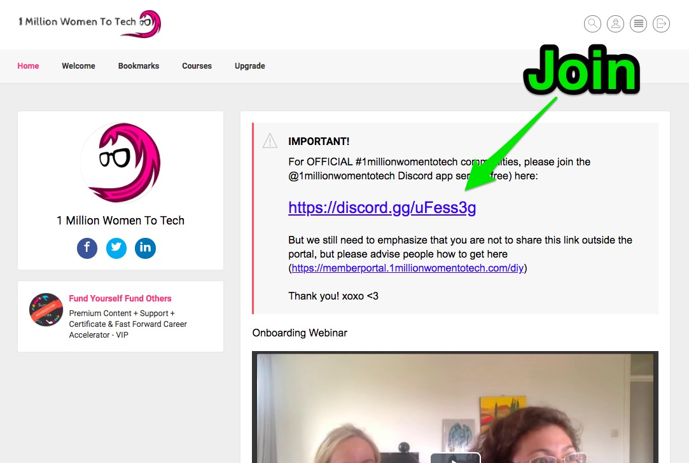
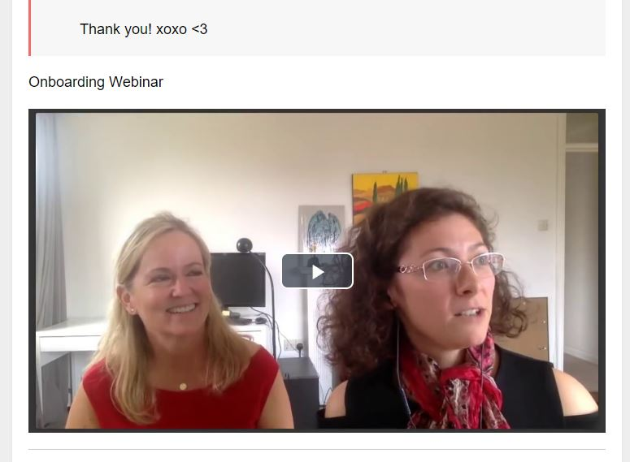
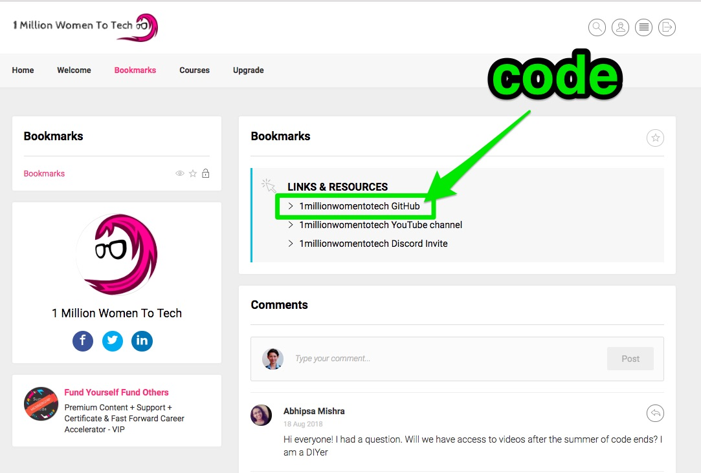
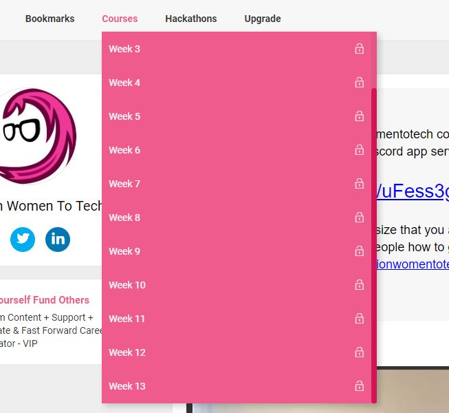
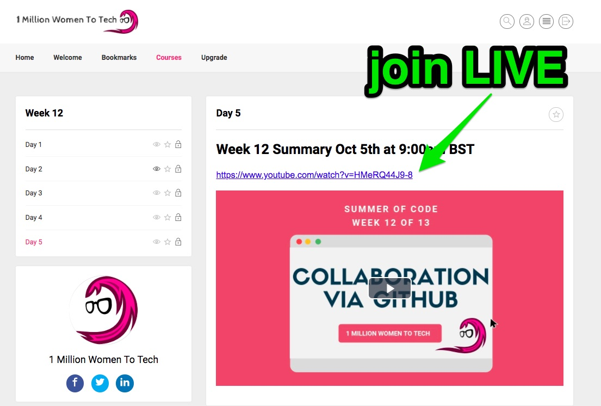
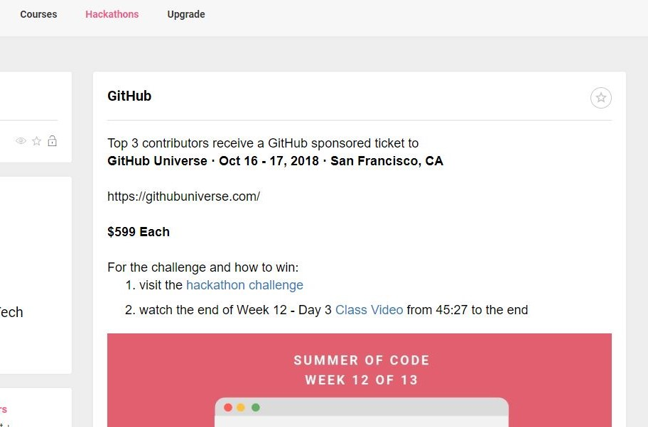
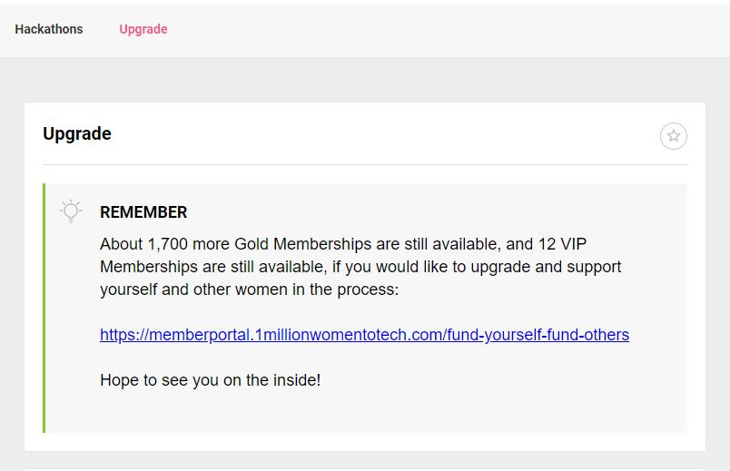

# DIY Memberportal Overview

## Log in to the memberportal
https://memberportal.1millionwomentotech.com/diy-login

## Home
### Discord
Join our community on Discord and interact with fellow learners in real-time.

### Onboarding webinar
Familiarise yourself with the mission and origins of 1millionwomentotech by watching the onboarding webinar.

## Bookmarks
Find important accompanying links such as the links to our Youtube channel and Github repository in the Bookmarks section.

## Courses
Access course content for every week here. 

Schedule:
- Mondays to Thursdays;
  * 9am BST: Live Teaser and Tips
  * 12pm BST: Class replay link posted to memberportal
- Fridays
  * 9am BST: Weekly summary, community update and hackathon announcement

## Hackathons

View information on weekly hackathons here.

Schedule:
- Friday, previous week; hackathon announcement during 9am BST weekly summary 
- Friday, same week; hackathon submissions close at 9am BST

## Upgrade

Here you can find information on upgrading to a GOLD or VIP membership.

