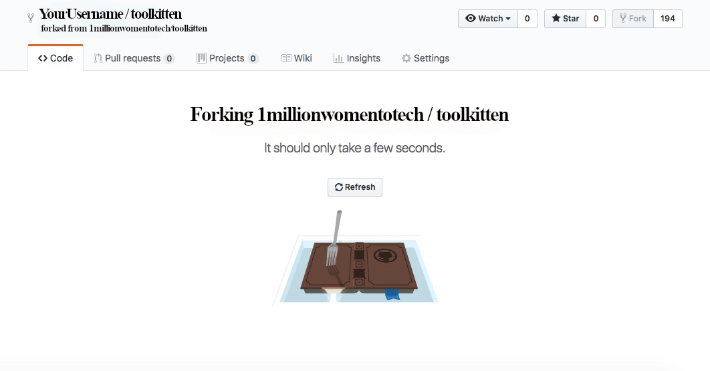
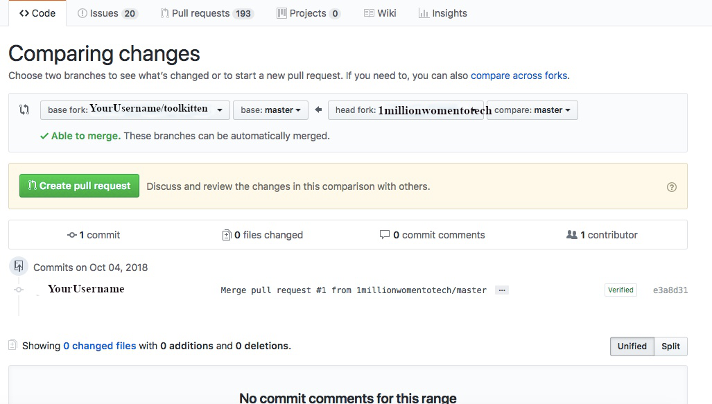
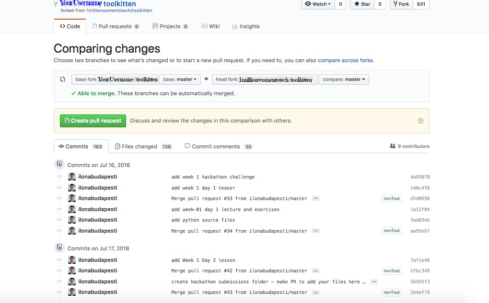

# HOWTO Fork and Update a Repository on Github

Follow these instructions after you have created an account on github.com.

1. Navigate to the 1 Million Women to Tech page on Github: https://github.com/1millionwomentotech

2. Select the toolkitten repository: https://github.com/1millionwomentotech/toolkitten

3. At the top right of the toolkitten repository you will notice the words 'watch', 'star' and 'fork'. 

      
4. Click on 'fork.'  

5. Your screen will change to an animation with the words 'Forking 1millionwomentotech/toolkitten.' 

6. Next, you are redirected to your own fork of toolkitten 'YourUsername/tollkitten.'

This is your copy of the toolkitten repository! It will only have the exact files that were in the original repository at the moment you created the fork. You will need to keep your fork closely synched to the original, 'upstream repository,' by merging changes daily (actual frequency will depend on the activity level of the upstream repository).  

## Updating Your Forked Repository

In order to ensure that your repository is up to date, you must pull and merge changed/new files from the upstream repository (1millionwomentotech/toolkitten).

1. Navigate to your fork or the repository, such as: https://github.com/YourUsername/toolkitten.

2. At the far right, middle of your screen, you will see 'pull request' and 'compare' under the green 'clone or download' button. Click 'compare.'

3. This will take you to 'comparing changes.'

4. Change the base fork to your own repository.

5. Change the head fork to 1millionwomentotech/toolkitten.

6. If your repository is in sync with the upstream you will see 'there isn’t anything to compare.' 

7. If there are new files/changes to the upstream repository then you will see a list of commits, file changes, and comments. 

8. In order to pull in those changes and merge them with your repository, click 'create pull request.'

9. Add a title and click 'create pull request.'

10. Assuming no conflicts, click 'merge pull request.'

11. Click 'confirm merge.'

12. Congratulations! You have just updated your repository to include all changes from the upstream repository!

