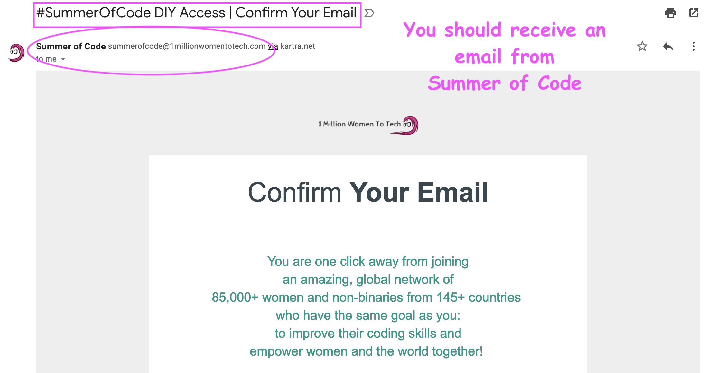
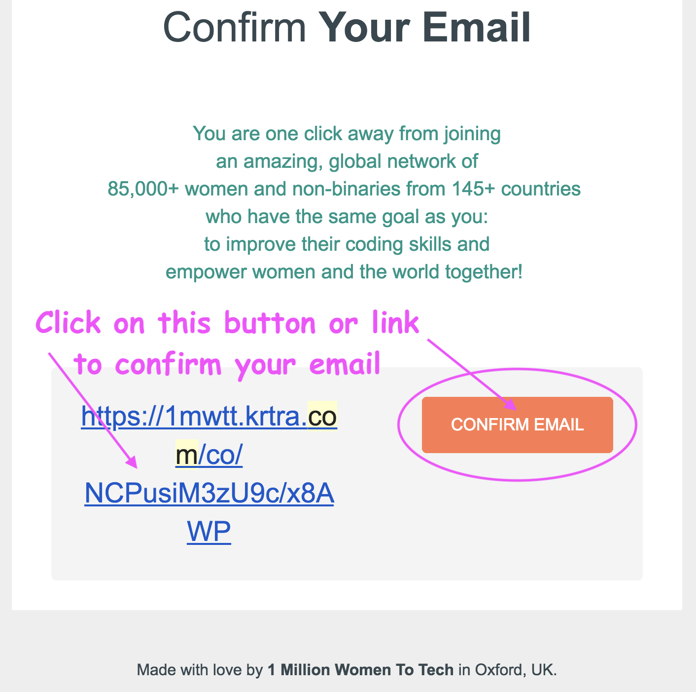
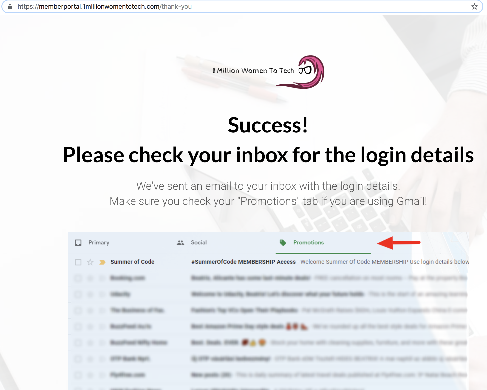
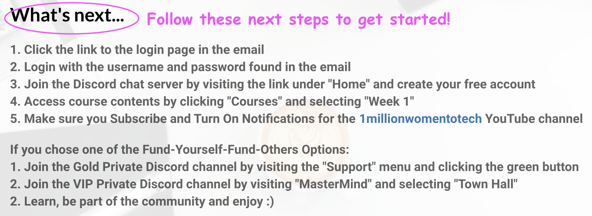

# HOW TO: Confirm your Email for Summer Of Code!

🎉 Congratulations on completing your [Summer of Code](https://1millionwomentotech.com/summerofcode1/) registration! 

For the last step of your registration, you need to **confirm your email address** 💌

## How to Confirm your Email

1. You should have received an email from **Summer of Code** with the subject line: **SummerOfCode DIY Access | Confirm Your Email**

- If you don't see it in your inbox, be sure to check your email's **spam box** and add the Summer of Code email to your contact list.
- Scroll down and click on the **CONFIRM EMAIL** button, or the link next to this button

2. A new page will open up to confirm you have successfully completed your registration!

 🎉🎉🎉 Yay! Your registration for Summer of Code program is now complete! 

Be sure to scroll down the page and follow the **What's next...** instructions ⭐️

And get started with the program!