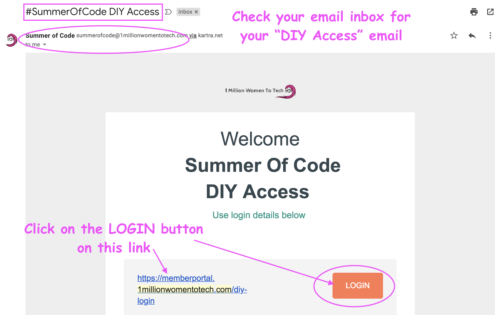
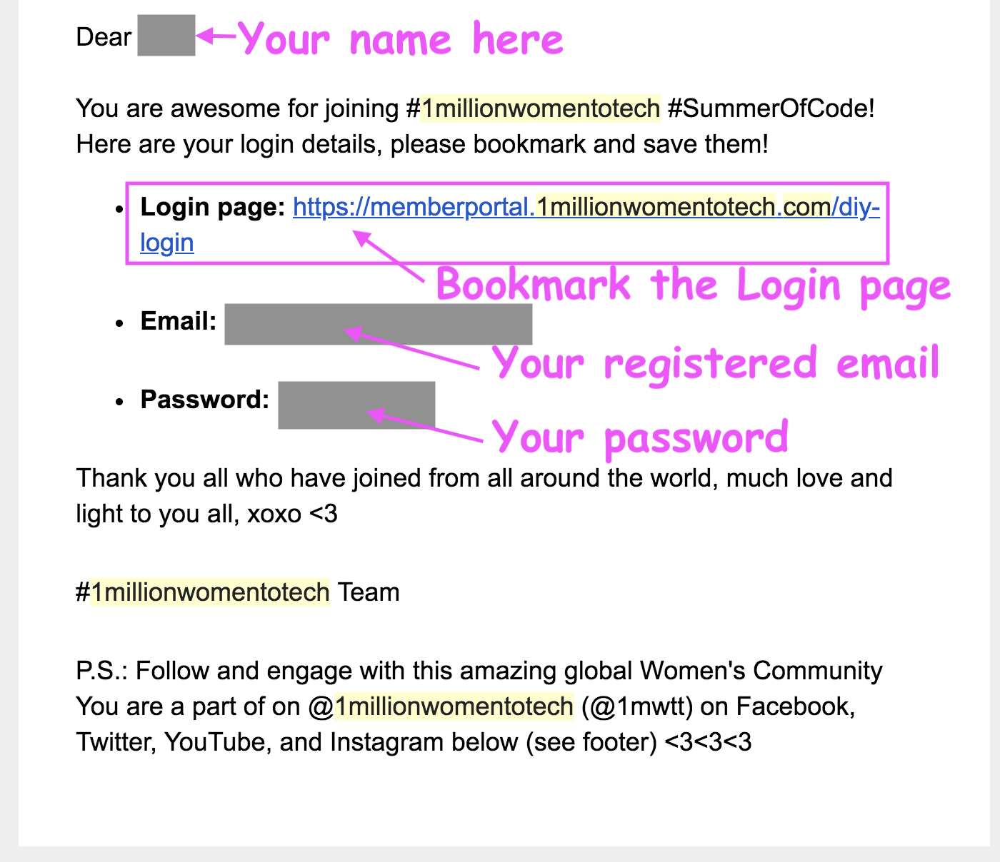
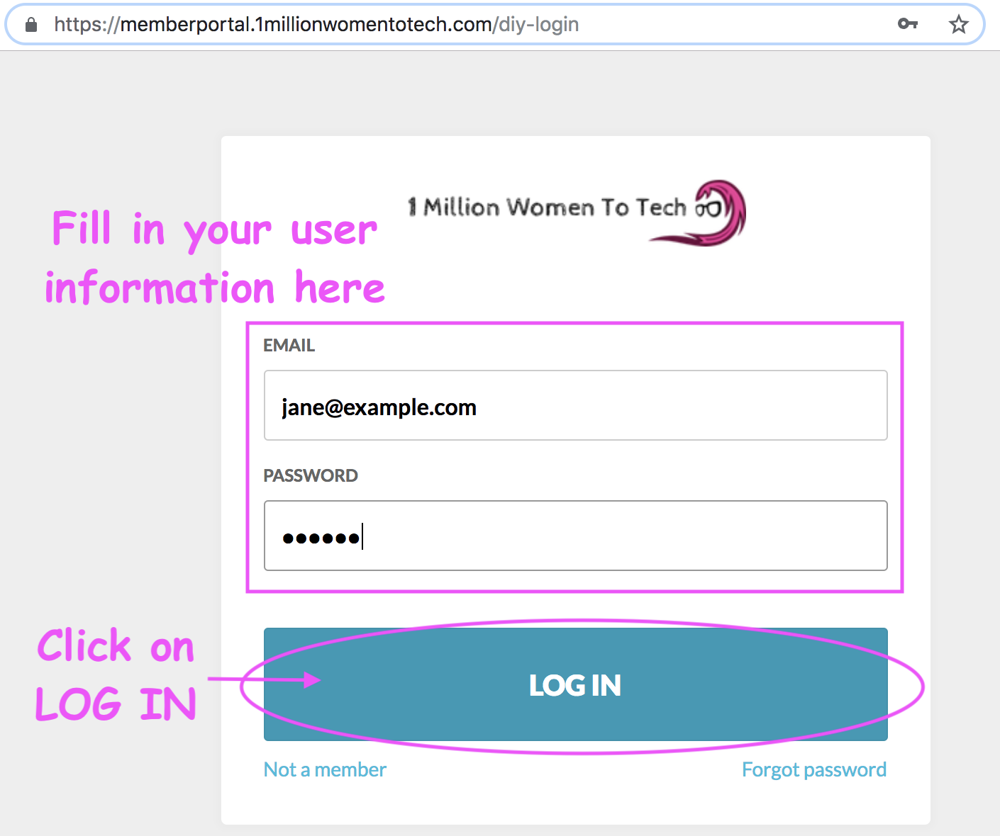
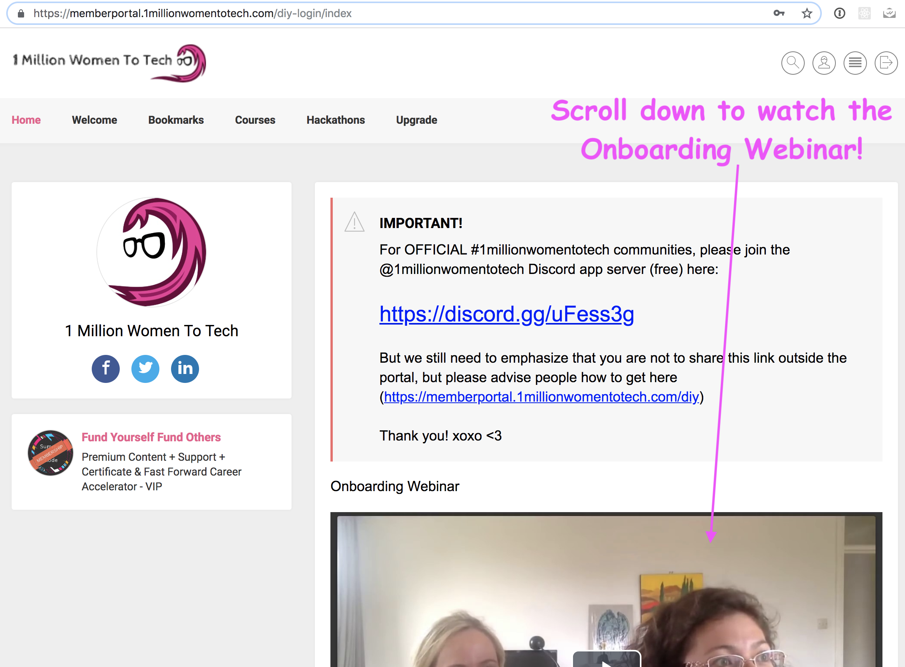

# HOW TO: Login to Summer Of Code DIY Member Portal

🎉 Congratulations on completing your [Summer of Code](https://1millionwomentotech.com/summerofcode1/) registration! 

You are now ready to **Login** to the Summer of Code [DIY Member Portal](https://memberportal.1millionwomentotech.com/diy-login/)

## Finding your username & password

1. You should have received an email from **Summer of Code** with the subject line: **SummerOfCode DIY Access**

- If you don't see it in your inbox, be sure to check your email's **spam box** and add the Summer of Code email to your contact list.
- Scroll down and click on the **LOGIN** button, or the link next to this button

- Scroll down a little further, and you will find your login email (this is the email address you used to register for the program) and your password. Don't worry, you can change your password once you login!

2. You will also find some useful links at the bottom of the email:
- [Learner FAQ](https://docs.google.com/document/d/1t7LEoPNMwue5MjipYJLdv_c34V3rqovu-6RByAhxNjs/edit): A Google document with Learners' FAQ
- [Mentor FAQ](https://docs.google.com/document/d/1YAqUz9taF25hmzEzRiBSn7pSZsv83WTTrhlIRyBUf3s/edit): A Google document with Mentors' FAQ
- [Hackathon and Course Syllabus](https://github.com/1millionwomentotech/toolkitten/tree/master/summer-of-code): The primary [Github repo](https://github.com/1millionwomentotech/toolkitten/tree/master/summer-of-code) with a detailed overview of Course Syllabus, Hackathon information and more!

3. Once you click on the **LOGIN** button from the email, a new page will open up. 

4. Fill in your email and password here, then click **LOGIN**

5. A new page will load, and you are now in the DIY Member only portal! 
Be sure to scroll down and watch the **Onboarding Video**

Have fun and start coding! ⌨️ 💻