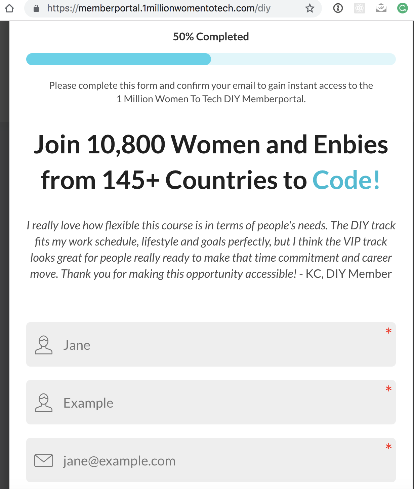
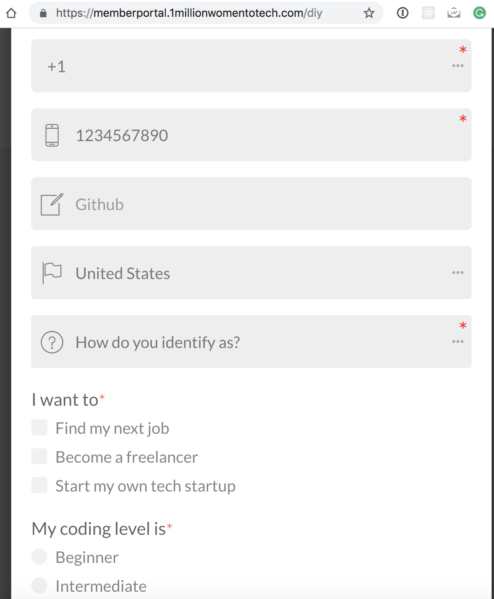
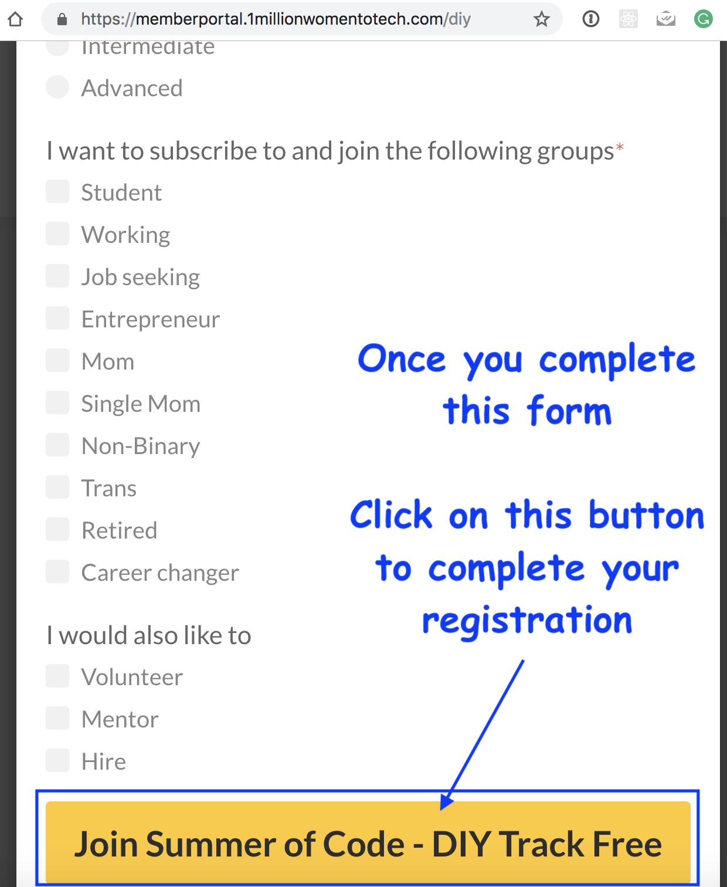

# HOW TO: Register for Summer Of Code!

Hello and welcome to the 1 Million Women To Tech – [Women’s Summer of Code program!](https://1millionwomentotech.com/summerofcode1/)

A 3-month global program focused on bringing more females into software development. Women can take free online coding courses and work in teams on programming challenges in weekly and monthly hackathons.

## About Us
Would you like to learn how to code? Or are you already a seasoned coder and would like to team up with other techie women – as well as win cool prizes? Then we’re hosting just the event for you! What’s more, all this happens online, so you can join from anywhere in the world.

We welcome women from **any backgrounds** – students and industry professionals, those who have coded for decades and those who are curious about trying something new. Anyone who identifies as female or non-binary is welcome; inclusion is our motto.

No matter the age – the computer cannot see your wrinkles, the computer cannot see your acne.

## How to Register

1. Visit the [Summer of Code website](https://1millionwomentotech.com/summerofcode1/)

2. Click on the **JOIN FREE** button - either one is fine!

3. A new page will open up, this time, click on the **JOIN NOW FOR FREE** button

4. A **sign-up form** will pop up, fill in your information.
- All required fields will have a red asterix `*` next to it
- If you have a [Github](https://github.com) profile, add your profile link at this time

Once you complete the form, click on the **JOIN SUMMER OF CODE - DIY TRACK FREE** button

5. 🎉🎉🎉 Yay! You are now registered for the Summer of Code program! 

You will see a confirmation page with a reminder to **check your email inbox** for a **confirmation email**.  You are almost done! 👏🏻

