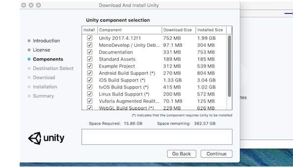
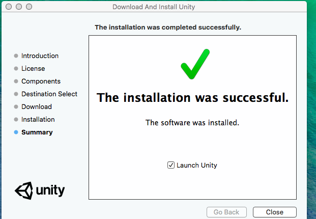
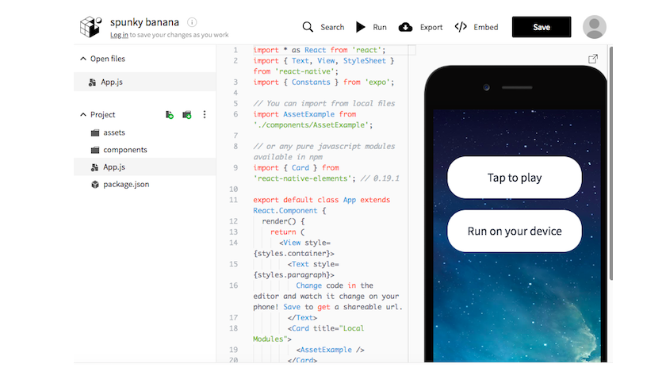
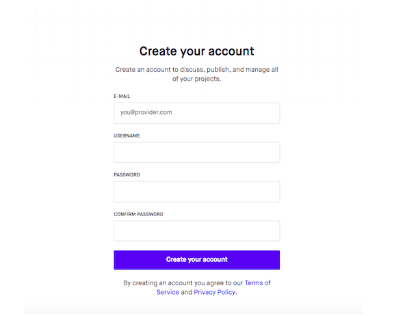
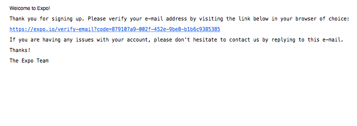

# HOWTO Installation and Signup Guide for MacOS

This document will detail how to install the applications and modules used during the Summer of Code. It will include instructions on how to sign up for websites and services which do not require download/installation. Users of Linux and Windows please refer to the appropriate guide.

### Table of Contents

* [Discord and Discord Desktop](#Install-Discord-Desktop)
* [Python](#Install-Python)
* [Sublime Text 3](#Install-Sublime-Text-3)
* [iTerm2](#Install-iTerm2)
* [PIP](#Install-pip)
* [NLTK](#Install-NLTK)
* [Jupyter Notebook via Anaconda](#Install-Jupyter-Notebook-via-Anaconda)
* [Jupyter Notebook without Anaconda](#Install-Jupyter-Notebook-without-Anaconda )
* [NodeJs](#Install-Nodejs)
* [NPM](#Install-NPM)
* [JavaScript Standard Style](#Install-JavaScript-Standard-Style)
* [InvisionApp](#Install-InvisionApp)
* [Ganache](#Install-Ganache)
* [Overflow](#Install-Overflow)
* [Unity3D](#Install-Unity3D)
* [Developer Mode on Android Phone](#Enable-Developer-Mode-on-Android-Phone)
* [JDK](#Install-JDK)
* [Android Studio - alternative to using an android phone](#Install-Android-Studio)
* [Tinkercad](#Register-for-Tinkercad)
* [Blender](#Install-Blender)
* [Android Studio](#Install-Android-Studio)
* [Sketchup](#Install-Sketchup)
* [Gimp](#Install-Gimp)
* [Gitkracken](#Install-Gitkracken)
* [Sourcetree](#Install-Sourcetree)
* [React.js](#Install-React.js)
* 
* 

## Install Python

## Install Sublime Text 3

## Install iTerm2

## Install pip

## Install NLTK

## Install Jupyter Notebook via Anaconda 

## Install Jupyter Notebook without Anaconda (for those who already have Python and prefer...)

## Install Nodejs

## Install NPM

## Install JavaScript Standard Style

## Signup for Invisionapp

## Install Ganache

## Install Overflow

## Install Unity3D
Unity3D is a cross-platform game engine used for games and interactive simulations and visualizations.

1. Navigate to the Unity downloads page.
https://unity3d.com/unity/qa/lts-releases

2. Select the newest LTS release. Under 'Unity Editor Download Assistant' click Download(Mac).

3. On the lower toolbar or in your downloads folder, click to open the Unity installer.

4. Click on the Unity Download Assistant.

5. A message will appear warning that Unity is dowloaded from the internet, click 'open.'

6. Go through the process process of approvals and agreements with the assistant.

7. Choose which components to install (the default is all).

8. MacOs requires your password for installation.

9. Select where to install.

10. The download and installation process will run for several minutes.

11. Process complete! Close the assistant, Unity will open automatically.

12. Move the Unity Download Assistant to the trash.

## Enable Developer Mode on Android Phone

## Install JDK

## Install Android Studio (if you do not have access to an android phone)

## Register for Tinkercad

## Install Blender

## Install Android Studio

## Install Sketchup

## Install Gimp

## Install Gitkracken

## Install Sourcetree

## Install React.js
There are two ways to work with React.js: you may work from your web browser or install to your computer.

Option 1:
To work with react in your browser, go to https://snack.expo.io/. To save your progress, select save, which will give you a permanent link.

2. You may also crreate an account to easily track your project.

3. You will recieve an email asking you to confirm your address.

Option 2: Create React App
This app will allow you to create an app with minimal installation, however the project size is limited to a one page app.

This installation requires you to have Node on your computer. If you did not install it during the Javascript course, please go back to the week 7 Node install.

1. In your terminal, change your directory to the location where you want your react project.

2. In your terminal, type: **npx create-react-app my-app**.

3. Change your directory to the location where you want your react project **cd .../my-app**.

4. Type: **npm start**.

Option 3: Expo CLI
This app is a command line environment will allow you to build projects.

This installation requires you to have Node on your computer. If you did not install it during the Javascript course, please go back to the week 7 Node install.

1. In your terminal, change your directory to the location where you want your react project: **cd .../my-app**..

2. Type **npm install -g expo-cli -- global**, this will install the Expo CLI command line utility.

3. Next, create a new project, type **expo init Project_Name**.

4. In your terminal change your directory to the new folder: **cd Project_Name**. Then **expo start**.
