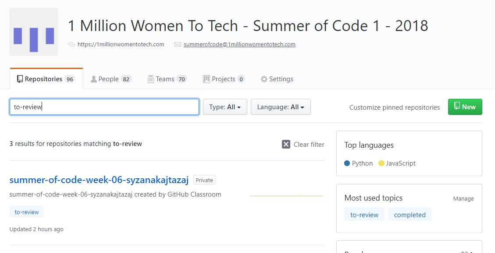
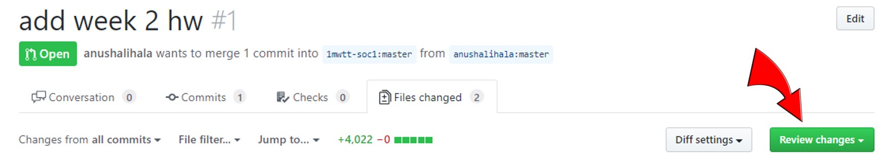
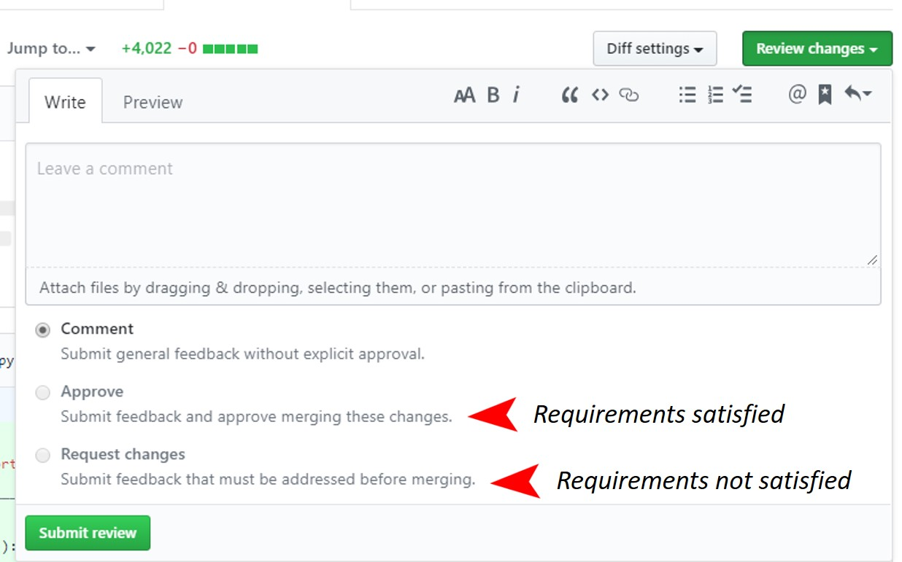

## Reviewing Assignments for SOC

- Ensure that you are a part of the 'mentors' team in the '1mwtt-soc1' organisation.

1. Go to [https://github.com/1mwtt-soc1](https://github.com/1mwtt-soc1)
2. In the `Find a repository...` search field search for assignments with the  'to-review' topic by typing in **to-review**, or [click here](https://github.com/1mwtt-soc1?utf8=%E2%9C%93&q=to-review&type=&language=) where it's done for you. Bookmark this page.

3. Choose the repository on the top of the list and click it.
4. Go to the **Pull Requests** tab 
5. Click on the (newest) open pull request.

6. Go to the **Files changed** tab 
7. Start your review as described in the [Mentors Level-1](https://1millionwomentotech.com/courses/mentors-level-1/) onboarding course. You can hit the big green **Review changes** button, or start by using the `+` signs next to the code.
  

8. If the Learner has satisfied all the requirements of the assignment, please
  - Select 'APPROVE'.
  - Submit the review.
- If the learner has not satisfied all the requirements of the assignment (for example if a Question is unanswered or not answered to the required degree of quality) and further changes are required for completion, please; 
  - Select 'REQUEST CHANGES'.
  - Submit the review.
  - Close the pull request. (The learner will submit the required changes via a new pull request) - TODO: trigger on a new push instead of new pull request.

Thank you!

> Notes:
> - Many HW assignments were submitted during SOC2018 before the bot was created and the required workflow enforced. 
>   - If there are no open pull requests, please check the closed pull requests. (For instance, some learners created a pull request and merged the changes). Continue to open the closed pull request and submit your review.
>   - If there are no pull requests at all.. (For instance, some learners committed directly to master). Please create an issue requesting them to submit a pull request for their homework.
