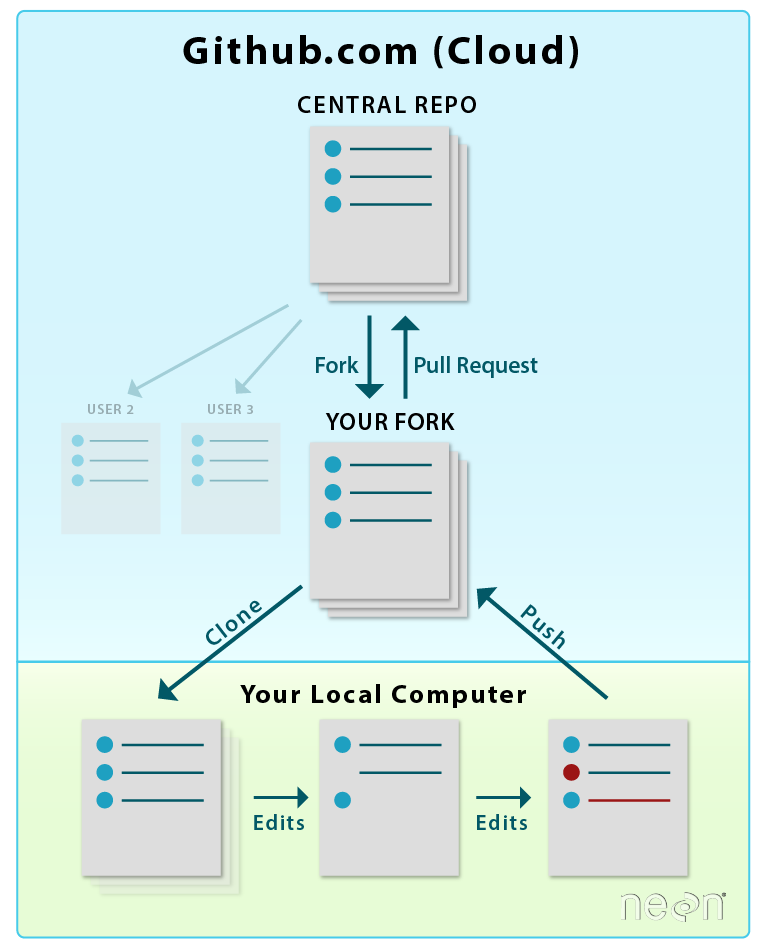

# 1 Million Women To Tech #SummerOfCode

## Week 12 GitHub - A gentle introduction to collaboration using GitHub

## Day 3

### Core workflow

Pull. Push. Repeat.

Clone
Pull changes
Handle merge conflicts
Commit changes
Push changes

### Issues

Notifications
- turn off

Issues
- creating
- commenting
- referencing

### Never rebase
