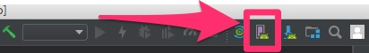

# 1 Million Women To Tech #SummerOfCode

## Week 13 React.js

## Day 2

Steps:
- unzip react-native-really-awesome-button.zip
- `cd react-native-really-awesome-button`
- `npm install`
- `npm start`
- download and install Android Studio, make sure to include Android Virtual Device
- open any project
- click on the emulator

- add virtual device: I use the newest Pixel (Pixel 2 - API 28)
- in the terminal check that the device is available  `adb devices`
